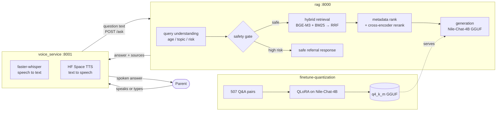

# ParentWise — AI-Powered Parenting Guidance Platform

An Arabic (Egyptian-colloquial), evidence-grounded parenting assistant. A parent
asks a question — by **voice or text** — and gets a warm, practical, **source-cited**
answer from a **fine-tuned language model** grounded in vetted parenting material
(UNICEF, WHO, and peer-reviewed Arabic research), with **safety guardrails** that
defer to a specialist on medical, emergency, or child-safety questions.

The platform is three components that fit together:

| Component | Folder | What it does |
|---|---|---|
| **Fine-tuning & quantization** | [`finetune-quantization/`](finetune-quantization/) | Turns `Nile-Chat-4B` into a parenting model (QLoRA), exports a CPU-friendly GGUF. Produces the model the RAG stack serves. |
| **RAG backend** | [`rag/`](rag/) | Retrieves relevant evidence, applies a safety gate, and generates a grounded answer with the fine-tuned model. Serves `POST /ask`. |
| **Voice service** | [`voice_service/`](voice_service/) | Speech-to-text (in), the RAG call, and text-to-speech (out). Serves `POST /ask_voice`, plus a browser demo. |

---

## Architecture



**End-to-end flow:** parent's audio → `voice_service` transcribes it → posts the text to
`rag` → RAG understands the query (age/topic/risk), runs the safety gate, retrieves and
reranks evidence, and generates a grounded Arabic answer with the fine-tuned model →
`voice_service` speaks the answer back. Typed questions skip the speech-to-text step.

---

## Repository layout

```
finetune-quantization/   dataset → QLoRA fine-tune → GGUF quantization (see its README)
rag/                     retrieval + safety + generation API   (see its README)
voice_service/           STT + TTS orchestration + demo UI
docs/                    project plan and documentation
```

## Models

| Model | Role | Source |
|---|---|---|
| `MBZUAI-Paris/Nile-Chat-4B` | Egyptian-Arabic base (Gemma-3) | Hugging Face |
| `dohaiismail/nile-chat-parenting-lora` | parenting LoRA adapter (GPU) | Hugging Face |
| `dohaiismail/nile-chat-parenting-lora-gguf` | quantized `q4_k_m` GGUF (CPU/Ollama) | Hugging Face |
| `BAAI/bge-m3` | dense retrieval embeddings (multilingual/Arabic) | Hugging Face |
| `BAAI/bge-reranker-v2-m3` | cross-encoder reranker | Hugging Face |
| `Systran/faster-whisper-small` | Arabic speech-to-text | Hugging Face |
| `omarelshehy/NAMAA-Egyptian-Voice` | Egyptian-Arabic text-to-speech | Hugging Face Space |

---

## Quickstart (run the platform locally)

Prerequisites: **Python 3.11** and ~8 GB free disk for the models. On Windows use
`py -3.11` so installs land in your real Python. A GPU is optional but strongly
recommended for interactive speed (see [Performance](#performance)).

### 1. Fine-tuned model
Either use the published GGUF (auto-downloaded on first RAG generation) or reproduce
it — see [`finetune-quantization/README.md`](finetune-quantization/README.md).

### 2. RAG backend (`rag/`)
```bash
cd rag
pip install -r requirements.txt
# one-time: download models + build the Chroma + BM25 indexes (resumable)
py -3.11 setup_rag.py           # add --no-gguf to skip the 2.5 GB model and use Claude instead
# serve
py -3.11 -m uvicorn app:app --port 8000
```
`setup_rag.py` prints the two `EMBEDDING_MODEL_PATH` / `RERANKER_MODEL_PATH` values to
export before `uvicorn` so the server reuses the local model snapshots instead of
re-downloading. Test it:
```bash
curl -X POST http://localhost:8000/ask -H "Content-Type: application/json" \
     --data "{\"question\": \"ابني عنده 5 سنين وبيعمل نوبات غضب، أعمل إيه؟\"}"
```

### 3. Voice service (`voice_service/`)
```bash
cd voice_service
pip install -r requirements.txt
cp .env.example .env            # then set HF_TOKEN in .env (needed for the TTS Space)
py -3.11 -m uvicorn stt_service:app --port 8001
```
Endpoints: `/stt`, `/tts`, `/ask_voice` (accepts `audio` **or** `text`), `/health`.

### 4. Demo UI
Open [`voice_service/parentwise_demo.html`](voice_service/parentwise_demo.html) in a
browser (it calls the voice service on `:8001`). Tap the mic and speak, or type a
question — you get a spoken, source-cited answer.

---

## Performance

Generation runs the 4B GGUF locally. The runtime matters a lot:

- **CPU via `llama-cpp-python`** (the default, no extra setup): correct but **slow —
  on the order of minutes per answer** on a laptop CPU. Fine for batch/offline use,
  not for a live demo.
- **GPU / Ollama (recommended for interactive use):** serve the same GGUF through
  Ollama, which uses the GPU (or an optimized CPU build) and answers in seconds. The
  fine-tuning side already targets this runtime (`eval/run_eval_ollama.py`).

If a live, low-latency experience is needed, run the model with Ollama/GPU rather than
the pure-CPU `llama-cpp-python` path. Retrieval (BGE-M3 + reranker) is unaffected — it
uses the GPU automatically when CUDA is available.

## Safety

Child-related advice is treated as safety-critical. A deterministic gate classifies
each query (`MEDICAL`, `EMERGENCY`, `CHILD_ABUSE`, `SELF_HARM`, …) **before** any
generation, and high-risk questions get a referral response (including the Egypt child
protection hotline `16000`) instead of model-generated advice. The model itself was
fine-tuned on explicit safety/refusal examples (no dosages, no diagnoses, escalate
emergencies). This is defense-in-depth, not a guarantee — it is not a substitute for a
qualified professional.

## Status

- ✅ Fine-tuned model (LoRA + GGUF) published; RAG retrieval, reranking, safety gate,
  and grounded generation working end-to-end.
- ✅ Voice service (STT + TTS + typed-text) working; browser demo included.
- ⚠️ Interactive latency requires the Ollama/GPU serving path (CPU is minutes/answer).
- The TTS text-to-speech depends on an external Hugging Face Space; if it is down,
  `/ask_voice` is unavailable while `/stt` and RAG `/ask` still work.
```
