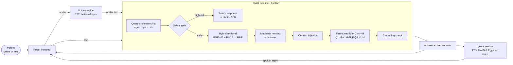

# AI-Powered Parenting Guidance Platform — *ParentWise*

An Arabic-first, evidence-grounded parenting assistant. A parent asks a question — by
**voice or text**, in Egyptian colloquial Arabic — and gets a warm, non-judgmental,
**source-grounded** answer that knows the difference between everyday parenting advice
and a medical/safety situation it should defer to a professional on.

> **Domain scope (deliberate):** behavioral, developmental, and educational parenting
> (discipline, tantrums, sleep, screen time, communication, milestones). The system is
> built to **refuse** medical diagnosis, medication dosing, and emergency self-treatment
> and redirect those to a pediatrician — this is enforced in both the fine-tuned model
> and a deterministic RAG safety gate, not left to chance.

---

## What it does



The three Gen-AI components are built and owned separately, then wired into one pipeline:

| Component | Folder | What it delivers |
|---|---|---|
| **RAG** (retrieval + generation + safety) | [`rag/`](rag/) | Ingests UNICEF/WHO/research sources, hybrid dense+sparse retrieval, metadata-aware ranking, reranker, deterministic safety gate, grounded generation with citations. |
| **Fine-tuning & optimization** | [`finetune-quantization/`](finetune-quantization/) | QLoRA fine-tune of **Nile-Chat-4B** into a parenting-tone assistant + GGUF (Q4_K_M) quantization for CPU inference. |
| **Voice (STT + TTS)** | [`voice_service/`](voice_service/) | Egyptian-Arabic speech-to-text (faster-whisper) and text-to-speech (NAMAA Egyptian voice) as a standalone FastAPI service. |

**Design principle — we tune *behavior*, ground *facts*:** the model is fine-tuned for
tone, structure, and safe refusals; the actual facts come from retrieved sources at
answer time. Fine-tuning shapes *how* the model answers; RAG decides *what* it answers with.

---

## Repository layout

```
├── README.md                     # you are here — whole-platform overview
├── docs/
│   ├── PROJECT_PLAN.md           # organized project plan (scope, roles, timeline)
│   └── DOCUMENTATION.md          # technical report: architecture → evaluation → limitations
├── rag/                          # RAG component (retrieval + generation + safety)
├── finetune-quantization/        # fine-tuning + quantization component
└── voice_service/                # STT + TTS component (FastAPI)
```

> **Branches:** the full platform lives on `main`. The `finetune+quantization` branch is
> the fine-tuning/optimization workstream. Component folders each carry their own README /
> testing docs — this top-level README ties them together.

---

## Quick start

Each component runs independently; the voice service and RAG API talk over HTTP.

### 1. RAG API (retrieval + generation)
```bash
cd rag
pip install -r requirements.txt
sudo apt-get install tesseract-ocr tesseract-ocr-ara   # Arabic OCR fallback
export ANTHROPIC_API_KEY=...                            # only for the Claude fallback provider
python ingest.py          # ingest + chunk sources listed in data/raw/*/manifest.json
python build_index.py     # build Chroma (dense) + BM25 (sparse) indexes
uvicorn app:app --reload  # serves POST /ask {"question": "..."}
```

### 2. Fine-tuned model (the default generator)
The fine-tuned, quantized model is published to Hugging Face and consumed by the RAG
layer as the `nile_chat_gguf` generation provider (runs on CPU via llama.cpp / Ollama).
To reproduce or retrain, see [`finetune-quantization/README.md`](finetune-quantization/README.md).

| Artifact | Use | Link |
|---|---|---|
| LoRA adapter | load on top of `MBZUAI-Paris/Nile-Chat-4B` (GPU) | https://huggingface.co/dohaiismail/nile-chat-parenting-lora |
| GGUF (`q4_k_m`) | run on CPU / local hosting | https://huggingface.co/dohaiismail/nile-chat-parenting-lora-gguf |

### 3. Voice service (STT + TTS)
```bash
cd voice_service
pip install -r requirements.txt
cp env.example .env          # set RAG_API_URL, STT_* options, optional HF token for TTS
python -m uvicorn stt_service:app --reload   # /stt (core) and /tts (bonus)
```

---

## Key results

| Metric | Result |
|---|---|
| Fine-tuning dataset | **507** Q&A pairs (483 grounded + 24 safety/refusal), Egyptian Arabic |
| Fine-tune method | QLoRA (4-bit), LoRA r=16 / α=16 / dropout 0.05, LR 1e-4, 2 epochs — trains **< 1%** of params |
| Quantization | 16-bit → **GGUF Q4_K_M**, ~**8 GB → 2.5 GB** (~3× smaller), CPU-capable |
| Inference speed | ~**9.2 tok/s** on a laptop CPU (greedy decoding) |
| Held-out evaluation | **28** rubric-graded questions, 0 overlap with training |
| RAG retrieval | BGE-M3 + BM25 → RRF → metadata ranking → bge-reranker-v2-m3 (top 5–8 chunks) |
| Voice | faster-whisper `small` (Arabic, VAD-tuned) + NAMAA Egyptian TTS |

See [`docs/DOCUMENTATION.md`](docs/DOCUMENTATION.md) for the full evaluation, including the
honest failure-mode analysis and future work.

---

## Team & ownership

Four engineers, each owning a distinct Gen-AI component (see
[`docs/PROJECT_PLAN.md`](docs/PROJECT_PLAN.md) for full role descriptions):

1. **RAG Engineer** — knowledge base, embeddings/vector DB, retrieval strategy, retrieval eval.
2. **Fine-Tuning & Optimization Engineer** — Q&A dataset, QLoRA training, base-vs-fine-tuned eval, quantization.
3. **Prompt Engineering & Frontend Engineer** — system prompt / few-shot strategy, response-quality eval, React UI.
4. **Voice AI & Backend/Integration Engineer** — Whisper STT (+ TTS), FastAPI backend, end-to-end integration.

---

## Limitations

This is an educational project and **not a substitute for professional medical or
psychological advice**. Evaluation surfaced real, documented failure modes (e.g. a dosage
question that produced a number, a choking scenario not escalated as an emergency) that are
addressed in the future-work plan. Facts are only as good as the retrieved sources, and the
TTS bonus depends on a third-party hosted voice model. Full detail in
[`docs/DOCUMENTATION.md`](docs/DOCUMENTATION.md#limitations--future-work).
